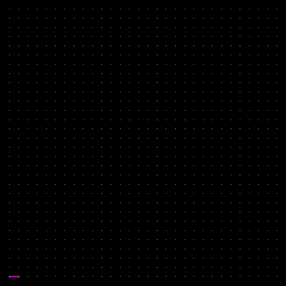
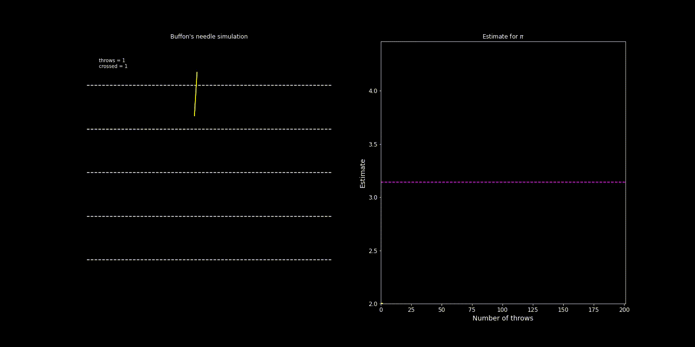
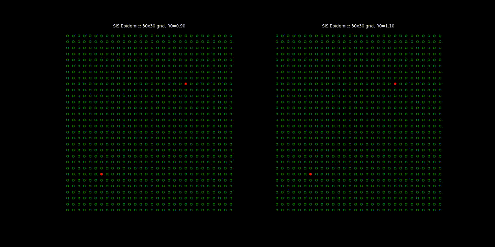

<a class="btn-lg btn-outline-primary" role="button" href="../../docs/ORIE4580F20/files/syllabus_4580_F20.pdf">
Course Syllabus</a>

| |
|:--:|
|  |
| *Random Spanning Tree via [Wilson's Algorithm](https://en.wikipedia.org/wiki/Loop-erased_random_walk#Uniform_spanning_tree)* |

## Course Description

Intro to Monte Carlo techniques and stochastic simulation. We will cover two topics:

- **Monte Carlo simulation**: Using randomness to aid complex computations.

| |
|:--:|
|  |
| *[Buffon's Needle](https://en.wikipedia.org/wiki/Buffon%27s_needle_problem) simulation for computing $\pi$* |

- **Discrete-event simulation**: Using stochastic models for *counter-factual analysis* (i.e., answering `what-if questions') in complex real-world systems. 

| |
|:--:|
|  |
| *[SIS epidemic model](https://en.wikipedia.org/wiki/Compartmental_models_in_epidemiology#The_SIS_model) below and above $R_0=1$* |

Topics include: random variable and process generation; data-driven distribution learning; input and output analysis; modeling and optimization of complex systems under uncertainty. Emphasis on $i.$ understanding how to use simulation to answer "what-if" questions, and $ii.$ tools and techniques needed in practice, in particular, modeling and simulation in Python.

## Course Information

- **Lectures**: TR 11:30am-12:45pm, Statler auditorium (room 185), [seating chart](../../docs/ORIE4580F20/files/STL185_COVID_Instruction_diag.pdf)
- **Instructor**: [Sid Banerjee](http://people.orie.cornell.edu/sbanerjee), 229 Rhodes Hall, [email](mailto:sbanerjee@cornell.edu)
- **Teaching Assistants**:
	* [Brittany Stenekes](mailto:bss99@cornell.edu)
	* [Gary Li](mailto:hl2362@cornell.edu)
	* [Ruifan Yang](mailto:ry298@cornell.edu)
	* [Shuwen Lu](mailto:sl3243@cornell.edu)
	* [Yuxuan Liu](mailto:yl2999@cornell.edu)
	
Recitation and office hours schedule available on Piazza.  

- [Course Syllabus](../../docs/ORIE4580F20/files/syllabus_4580_F20.pdf)

- **Course Logistics**:

	This semester, the course combines a hybrid class (ORIE 4580), a full semester online class (ORIE 5580) and a half semester online class (ORIE 5581). We will try our best to ensure things run smoothly, but really depend on (and appreciate!) your help in this.
	
	- **Zoom**: Main [lecture meeting link](https://cornell.zoom.us/j/96721588095) (passwd and OH/recitation links on Piazza)
	- **Canvas**: We have a [combined Canvas page](https://canvas.cornell.edu/courses/22758/) (please join if not added).
    - **Piazza**: All announcements and resources will be posted on a [Combined Piazza page](https://piazza.com/cornell/fall2020/orie458055805581combined). Please join the site immediately if not automatically added.
	- **CMSx**: Homework submissions must be done electronically via [CMSx](https://cmsx.cs.cornell.edu/web/auth/?action=viewCUmemb&courseid=689). You should be automatically signed up for this (please tell us immediately if not).
	- **iClicker**: Students must use the REEF Polling app for in-class tests. Please see the following [instructions](../../docs/ORIE4580F20/files/iClicker-REEF-Student-Info.pdf).
	

## Course Material

<!-- * <embed src="https://drive.google.com/viewerng/
viewer?embedded=true&url=https://people.orie.cornell.edu/sbanerjee/docs/ORIE4580F18/files/ORIE4580F18-IntroClass.pdf" width="480" height="360">
-->

* **Course notes**: 
	These will be uploaded on Piazza  before the class. Students are encouraged to annotate them.

* **Textbook**:  _[Simulation](https://newcatalog.library.cornell.edu/catalog/8738175)_ by Ross; This is the suggested textbook for the course. An e-copy is available online on the Cornell library website.

*   **Coding Resources**:

    The assignments in the first half of semester can be done in any high-level language; our recommendation is for using [Python](https://www.python.org/) (in particular, we will use Python 3.6 for our solutions) and [Jupyter notebooks](http://jupyter.org/). 
	
    *   For desktop use, we recommend installing a package manager like [Anaconda](https://www.continuum.io/downloads), which installs Python, the Jupyter Notebook, and other commonly used packages. *For coding online, we highly recommend [Google Colab](https://colab.research.google.com/) (this is also great for collaboration with teammates).*
    *   The [python tutorial](https://docs.python.org/3.6/tutorial/index.html) is a good place to look up basic and advanced syntax. It should help you map other programming knowledge you have to Python.
    *   The power of Python lies in its many packages - use [library reference](https://docs.python.org/3.6/library/index.html) to find standard library modules to help get your work done quickly. 
	*   Additional packages we will use extensively are NumPy, SciPy (and also SimPy for DES). There are many more functions in scipy and numpy than you can remember, so for a given task look at the [scipy reference](http://docs.scipy.org/doc/scipy/reference/) or [numpy reference](http://docs.scipy.org/doc/numpy/reference/) to find the tool you are looking for. Also, read [numpy for MATLAB users](http://wiki.scipy.org/NumPy_for_Matlab_Users) if you are familiar with MATLAB.
    *   For visualization, we will use Matplotlib and Seaborn. Matplotlib has many built-in plotting capabilities, and the [matplotlib gallery](http://matplotlib.org/gallery.html) is a good way to find code snippets for tasks similar to what you need. [Seaborn](https://seaborn.pydata.org/index.html) is another great visualization package for data analysis -  less powerful in general, but easier to use for standard tasks.
    *   Finally, searching online for a task often brings up excellent suggestions in sites like [StackExchange](https://stackexchange.com/). Get used to using this!

    In the second half of semester, we will briefly look at a commercial simulation package, [Simio](https://www.simio.com/index.php). This only operates on PCs, or on Macs running Windows. Simio is available in 571 Rhodes Hall and 453 Rhodes Hall. Students may consider obtaining the student version of Simio ($25, available [here](https://www.simio.com/academics/student-resources.php)) - this imposes limits on the size of the models, but should be sufficient for our course.
	