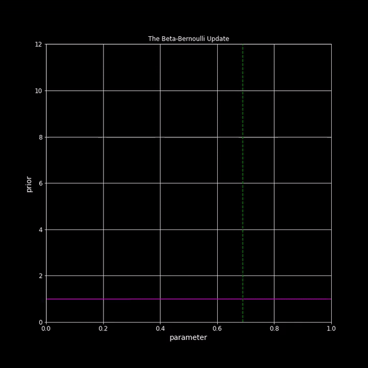

| |
|:--:|
|  |
| *[Beta-Bernoulli Update](https://en.wikipedia.org/wiki/Beta-binomial_distribution)* |

<!--
<embed src="https://drive.google.com/viewerng/
viewer?embedded=true&url=https://people.orie.cornell.edu/sbanerjee/docs/ORIE4742S21/files/ORIE4742S20-IntroClass.pdf" width="480" height="360">
-->

## Course Information

- **Lectures**: MW 11:25am-12:40pm, Mann 107
- **Instructor**: [Sid Banerjee](http://people.orie.cornell.edu/sbanerjee), 229 Rhodes Hall, [email](mailto:sbanerjee@cornell.edu)
- **Teaching Assistant**: [Spencer Peters](mailto:sp2473@cornell.edu)
	
Recitation and office hours available on Piazza.  

<!--
- [Course Syllabus](../../docs/ORIE4580F20/files/syllabus_4580_F20.pdf)
-->

- **Course Logistics**:

	- **Zoom**: Main [lecture meeting link](https://cornell.zoom.us/j/93025504345) (passwd: Shannon)
    - **Piazza**: All course communications via [Piazza page](https://piazza.com/cornell/spring2021/orie4742). Please join immediately if not automatically added.
	- **CMSx**: Homework submissions must be done electronically via [CMSx](https://cmsx.cs.cornell.edu/beta/course/807).
	

## Textbooks

We will mainly follow two textbooks

*	_[Information Theory, Inference, and Learning Algorithms](http://www.inference.org.uk/mackay/itila/book.html)_ by David Mackay

*	_[Pattern Recognition and Machine Learning](https://www.microsoft.com/en-us/research/uploads/prod/2006/01/Bishop-Pattern-Recognition-and-Machine-Learning-2006.pdf)_ by Chris Bishop
	
Both these books have free pdfs available on their websites, and are both excellent resources! We will cover a selection of chapters from each, as well as some additional topics (depending on time/interest).

## Lecture Notes

*   **Lecture 1**: Introduction 

	-- [[slides]](../../docs/ORIE4742S21/files/ORIE4742S21-IntroClass.pdf)
	
	-- [[annotated]](../../docs/ORIE4742S21/files/Lec1-Introclass-Annotated.pdf)
	   [[lecture recording]](https://vod.video.cornell.edu/media/ORIE4742-Lecture1/1_akkifixt)   
	-- Who was Claude Shannon: _[short documentary](https://www.uctv.tv/computer-science/search-details.aspx?showID=6090)_  and _[longer movie](https://thebitplayer.com/)_ 
	    

*   **Lecture 2**: Probability review 

	-- [[slides]](../../docs/ORIE4742S21/files/ProbReview-Slides.pdf)
	
	-- [[annotated]](../../docs/ORIE4742S21/files/Lec2-ProbReview-Annotated.pdf)
	   [[lecture recording]](https://vod.video.cornell.edu/media/ORIE4742-Lecture2/1_x0l1za02)  
	-- Demo of Bertrand's paradox: [[Jupyter notebook]](../../docs/ORIE4742S21/files/BertrandsParadox.ipynb)    
	-- Intuitive demos: _[conditional probability](https://setosa.io/conditional/)_, _[Bayes theorem](https://www.youtube.com/watch?v=HZGCoVF3YvM&t=17s)_, _[likelihood ratios](https://www.youtube.com/watch?v=lG4VkPoG3ko&t=3s)_
	

*   **Lecture 3**: Measuring information 
	
	-- [[slides]](../../docs/ORIE4742S21/files/InformationMeasures-Slides.pdf)
	
	-- [[annotated]](../../docs/ORIE4742S21/files/Lec3-Measuring-Information-Annotated.pdf)
	   [[lecture recording]](https://vod.video.cornell.edu/media/ORIE4742/1_zo43lt54)  
	-- Some videos: _[Shannon's formula of entropy](https://www.youtube.com/watch?v=R4OlXb9aTvQ)_, _[Documentary on "Order and Disorder"](https://www.youtube.com/watch?v=qj7HH0PCqIE)_ (traces entropy from physics to computer science to information theory)
	

*   **Lecture 4**: Data compression 1: Lossy compression

	-- [[slides]](../../docs/ORIE4742S21/files/Lec4-Source-Coding-LossyCoding.pdf)
	
	-- [[annotated]](../../docs/ORIE4742S21/files/Lec4-Source-Coding-Annotated.pdf)
	   [[lecture recording]](https://vod.video.cornell.edu/media/ORIE4742/1_9h5q46aq)  
	-- Video series on data compression (by Google developers): _[Compressor Head](https://www.youtube.com/playlist?list=PLOU2XLYxmsIJGErt5rrCqaSGTMyyqNt2H)_

*   **Lecture 5**: Data compression 2: Typicality and lossless compression

	-- [[annotated]](../../docs/ORIE4742S21/files/Lec5-Source-Coding-Lossless.pdf)
	   [[lecture recording]](https://vod.video.cornell.edu/media/ORIE4742-Sp21-Lecture5/1_vwzzdljc)  
	-- [Kraft-Mcmillan inequality](https://en.wikipedia.org/wiki/Kraft%E2%80%93McMillan_inequality) (check out the proof of the general case; I personally find it quite unique and surprising!)  

*   **Lecture 6**: Data compression 3: The entropy lower bound, and symbol codes

	-- [[annotated]](../../docs/ORIE4742S21/files/Lec6-Source-Coding-SymbolCodes.pdf)
	   [[lecture recording]](https://vod.video.cornell.edu/media/ORIE4742-Sp21-Lecture6/1_ak7d2qxo)  
	-- [Huffman codes](https://en.wikipedia.org/wiki/Huffman_coding)  
	-- A very nice visual explanation of information and symbol codes: [Visual information theory](https://colah.github.io/posts/2015-09-Visual-Information/)   

*   **Lecture 7**: Data compression 4: Stream codes

	-- [[annotated]](../../docs/ORIE4742S21/files/Lec7-Source-Coding-StreamCodes.pdf)
	   [[lecture recording]](https://vod.video.cornell.edu/media/ORIE4742-Sp21-Lecture7/1_br8zs7zf)  
	-- Using arithmetic codes for predictive typing: [Dasher project](https://www.inference.org.uk/dasher/), short [demo](https://www.youtube.com/watch?v=nr3s4613DX8), [talk](https://www.youtube.com/watch?v=0d6yIquOKQ0) by David Mackay

*   **Lecture 8**: Dependent random variables and mutual information

	-- [[slides]](../../docs/ORIE4742S21/files/ChannelCoding-Slides.pdf) 
	
	-- [[annotated]](../../docs/ORIE4742S21/files/Lec8-DependentRVs.pdf)
	   [[lecture recording]](https://vod.video.cornell.edu/media/ORIE4742-Sp21-Lecture8/1_i3220rmt) 	

*   **Lecture 9**: The channel coding theorem

	-- [[annotated]](../../docs/ORIE4742S21/files/Lec9-ChannelCoding.pdf)
	   [[lecture recording]](https://vod.video.cornell.edu/media/ORIE4742-Sp21-Lecture9/1_lc5r129m) 	

*   **Lecture 10**: Intro to Bayesian statistics  
	
	-- [[slides]](../../docs/ORIE4742S21/files/BayesianStats-Slides.pdf)  

	-- [[annotated]](../../docs/ORIE4742S21/files/Lec10-IntrotoBayesianStats.pdf)
	   [[lecture recording]](https://vod.video.cornell.edu/media/ORIE4742-Sp21-Lecture10/1_2sv9ha9c) 	

*   **Lecture 11**: The Beta-Bernoulli model
	
	-- [[annotated]](../../docs/ORIE4742S21/files/Lec11-BetaBernoulli.pdf)
	   [[lecture recording]](https://vod.video.cornell.edu/media/ORIE4742-Sp21-Lecture11/1_9vyik8yn) 	

*   **Lecture 12**: Bayesian Networks 
	
	-- [[slides]](../../docs/ORIE4742S21/files/BayesNets-Slides.pdf)  

	-- Guest lecture by [Spencer Peters](https://www.cs.cornell.edu/~speters/)

	-- [[annotated]](../../docs/ORIE4742S21/files/Lec12-BayesNets.pdf)
	   [[lecture recording]](https://vod.video.cornell.edu/media/ORIE4742-Sp21-Lecture12/1_xu4ot967) 	

*   **Lecture 13**: The Dirichlet model and Naive Bayes
	
	-- [[annotated]](../../docs/ORIE4742S21/files/Lec13-NaiveBayes.pdf)
	   [[lecture recording]](https://vod.video.cornell.edu/media/ORIE4742-Sp21-Lecture13/1_ylig07lu) 	

*   **Lecture 14**: The Gaussian-Gaussian and Gaussian-Gamma models

	-- [[annotated]](../../docs/ORIE4742S21/files/Lec14-GaussianModels.pdf)
	   [[lecture recording]](https://vod.video.cornell.edu/media/ORIE4742-Sp21-Lecture14/1_r9d8iuwg) 	
	

*   **Lecture 15**: Bayesian Linear Regression

	-- [[slides]](../../docs/ORIE4742S21/files/Regression-Slides.pdf)  
	-- Bayesian regression notebook: [[Jupyter notebook]](../../docs/ORIE4742S21/files/BayesianRegression.ipynb)    

	-- [[annotated]](../../docs/ORIE4742S21/files/Lec15-BayesianRegression.pdf)
	   [[lecture recording]](https://vod.video.cornell.edu/media/ORIE4742-Sp21-Lecture15/1_4nhjw2gd) 	

*   **Lecture 16**: Bayesian Model Selection

	-- [[annotated]](../../docs/ORIE4742S21/files/Lec16-BayesianModelSelection.pdf)
	   [[lecture recording]](https://vod.video.cornell.edu/media/ORIE4742-Sp21-Lecture16/1_ett958xm) 	

*   **Lecture 17**: Gaussian Processes

	-- [[slides]](../../docs/ORIE4742S21/files/GaussianProcess-Slides.pdf)  

	-- [[annotated]](../../docs/ORIE4742S21/files/Lec17-GaussianProcesses.pdf)
	   [[lecture recording]](https://vod.video.cornell.edu/media/ORIE4742-Sp21-Lecture17/1_49xfvwdh) 	

*   **Lecture 18**: Gaussian Process Regression

	-- GP regression notebook: [[Jupyter notebook]](../../docs/ORIE4742S21/files/GPRegression.ipynb)    

	-- [[annotated]](../../docs/ORIE4742S21/files/Lec18-GPRegression.pdf)
	   [[lecture recording]](https://vod.video.cornell.edu/media/ORIE4742-Sp21-Lecture18/1_a186wo1f) 	

*   **Lecture 19**: Hyperparameter Tuning via Empirical Bayes, GP Classification

	-- [[annotated]](../../docs/ORIE4742S21/files/Lec19-GPModelSelection.pdf)
	   [[lecture recording]](https://vod.video.cornell.edu/media/ORIE4742-Sp21-Lecture19/1_bx2f1409) 	

*   **Lecture 20**: GP classification via the Laplace Approximation

	-- [[annotated]](../../docs/ORIE4742S21/files/Lec20-LaplaceApprox.pdf)
	   [[lecture recording]](https://vod.video.cornell.edu/media/ORIE4742-Sp21-Lecture20/1_ycp6fuwu) 	

*   **Lecture 21**: Laplace Approximation, and Intro to Monte Carlo methods

	-- GP classification notebook: [[Jupyter notebook]](../../docs/ORIE4742S21/files/GPClassification.ipynb)    

	-- [[annotated]](../../docs/ORIE4742S21/files/Lec21-LaplaceApprox_MCMC.pdf)
	   [[lecture recording]](https://vod.video.cornell.edu/media/ORIE4742-Sp21-Lecture21/1_snzzmr8j) 	

*   **Lecture 22**: Importance Sampling and Intro to Markov Chains

	-- [[annotated]](../../docs/ORIE4742S21/files/Lec22-ImportanceSamplingAndMarkovChains.pdf)
	   [[lecture recording]](https://vod.video.cornell.edu/media/ORIE4742-Sp21-Lecture22/1_svfcba55) 	

*   **Lecture 23**: Markov Chain Monte Carlo

	-- MCMC notebook: [[Jupyter notebook]](../../docs/ORIE4742S21/files/MCMC_Metropolis_Hastings.ipynb)    

	-- [[annotated]](../../docs/ORIE4742S21/files/Lec23-MCMC.pdf)
	   [[lecture recording]](https://vod.video.cornell.edu/media/ORIE4742-Sp21-Lecture23/1_k6bgnhjk) 	

*   **Lecture 24**: Mixture Models and the EM Algorithm

	-- Gaussian Mixture Models notebook: [[Jupyter notebook]](../../docs/ORIE4742S21/files/Gaussian_Mixture_Model.ipynb)    
		
	-- [[annotated]](../../docs/ORIE4742S21/files/Lec24-MixtureModels.pdf)
	   [[lecture recording]](https://vod.video.cornell.edu/media/ORIE4742-Sp21-Lecture24/1_57c6mvv2) 	

	   

<!--

*   **Set 6**: Basic Bayesian regression and classification [[notes]](../../docs/ORIE4742S21/files/Lec18-Bayesian_Regression.pdf)  

*   **Set 11**: Gaussian processes and GP regression  [[notes]](../../docs/ORIE4742S21/files/Lec19-Gaussian_Processes-Annotated.pdf)  

*   **Set 6**: Bayesian networks  [[notes]](../../docs/ORIE4742S21/files/Lec14-15-Bayesian_Networks-annotated.pdf)  

*   **Set 9**: Monte Carlo methods  [[notes]](../../docs/ORIE4742S21/files/Lec16-17-Monte_Carlo_Methods-annotated.pdf)  

*   **Set 10**: Decision theory - Basics, MDPs and reinforcement learning  [[notes]](../../docs/ORIE4742S21/files/Lec20-Decision_Theory-annotated.pdf)  

-->
	
## Assignments

*   **Assignment 1**: [Problems](../../docs/ORIE4742S21/files/HW1.pdf) 

*   **Assignment 2**: [Problems](../../docs/ORIE4742S21/files/HW2.pdf) 
	